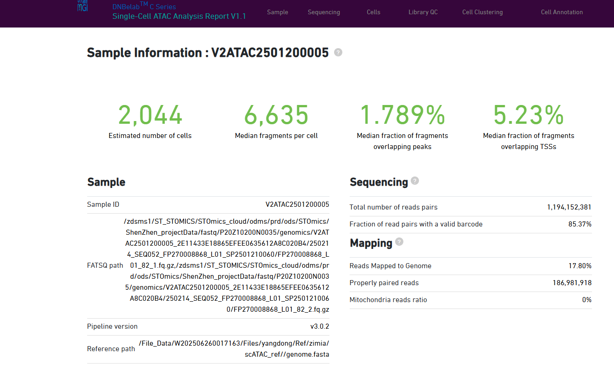

```shell
chromap -i -r /data/input/Files/yuantingting/Zimia/split_zamia_v3/merge2.fasta -o index -k 27 -w 14
chromap -i -r /data/input/Files/yuantingting/Zimia/split_zamia_v3/merge2.fasta -o index -k 28 -w 16
#chromap: src/minimizer_generator.h:20: chromap::MinimizerGenerator::MinimizerGenerator(int, int): Assertion `kmer_size_ > 0 && kmer_size_ <= 28' failed.
chromap -i -r your_reference.fa -o output_index -k 17 -w 7
```