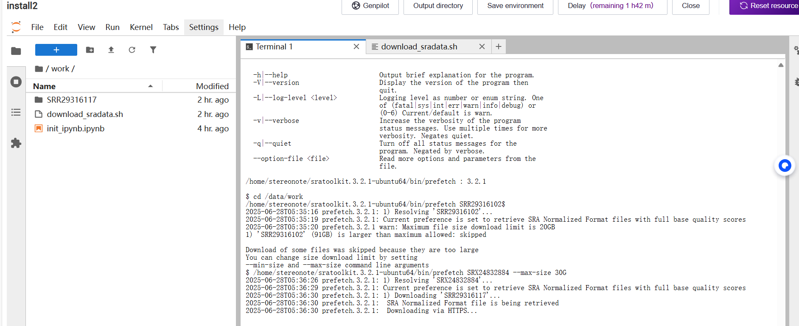

# 资料
[DCS doc](https://cloud.stomics.tech/helpcenter/zh/)
[runoob.com](https://www.runoob.com/)
[shell doc](https://www.runoob.com/linux/linux-shell.html)
[VScode: wsl+ubuntu](https://blog.csdn.net/yao00037/article/details/119858692)

---
拟南芥数据与棉花数据做跨物种注释
  - 拟南芥数据恢复为rds/h5ad文件
  - 拟南芥

# 公共数据下载
启动个性分析资源选`install software`就有联网权限，可使用`wget`或其它工具e.g.`sratools`来下载数据
*注意联网时该容器不可以挂载数据，建议专门留一个容器用于`install`*

> 下载数据比笔记本电脑快，25G的文件花了3h22m


# 个性分析
1. 启动 (镜像-资源-数据挂载)
2. 目录结构 (/data/work; /data/input; /data/output; /data/users)
3. 非/data目录，储存系统文件或者镜像文件，关注conda的环境路径，便于我们后期环境配置和调用
   - 环境配置 [Anaconda 教程](https://www.runoob.com/python-qt/anaconda-tutorial.html)
4. 同一项目下不同容器间的文件交流`/data/user`
5. 基础命令(shell)
  - 路径（绝对路径；相对路径；工作路径）
```shell
cd /data/work/file
cd ./work/file
cd work
cd ~
cd ..
```
  - 文件处理
```shell
# 复制
cp file1.txt ./output/file1.txt
# 移动或重命名
mv file1.txt file2.txt
# 删除
rm file1.txt
# 删除文件夹
rm -rf files
# 文件压缩
tar -czvf file.tar.gz file
# 文件解压缩
tar -xzvf file.tar.gz 
```
  - 文本处理
```shell
vim /data/work/file/file1.txt
# 可以先cp到/data/work下然后文本编辑
```

  - 循环
```shell
#!/bin/bash

for i in {1..5}
do
    echo "Number: $i"
done
```
  - 控制
```shell
#!/bin/bash

num=15

if [ $num -gt 10 ]; then
    echo "The number is greater than 10."
else
    echo "The number is not greater than 10."
fi
```
  - shell脚本
```shell
sh /data/work/file/work.sh
```

> 单细胞数据常见的3种存在方式 10X; seurat_object(rds); anndata(h5ad); singlecellexperiment(sce)
```R
# 读取10X格式文件
matrix <- Read10X("/data/users/yangdong/yangdong_2af59f1294604c5187d7737fd0e2c80d/online/dataget/result/V3RNA25021000051", gene.column=1)
```

5. R中的单细胞数据分析[Seurat](https://satijalab.org/seurat/)
  - seurat对象(rds文件)
```R
library(Seurat)
seu <- readRDS("/data/users/yangdong/yangdong_faff775391984da0a355d4bd70217714/online/SCPipelines/bulk_RNA_scRNA_singleR/split/seu_day-2.rds")

print(seu) # 查看大致信息cell数和gene数等
str(seu) # seurat对象的详细结构信息

# 常用查看命名
colnames(seu@meta.data)
head(seu@meta.data)
head(rownames(seu))
head(colnames(seu))

saveRDS(seu, "dealed_seu_day-2.rds")

# 其它降维聚类可视化操作 [pbmc3k_tutorial](https://satijalab.org/seurat/articles/pbmc3k_tutorial)
```
  - 细胞注释

6. python中的单细胞数据分析[scanpy](https://scanpy.readthedocs.io/)
  - scanpy对象(anndata)
```python
import scanpy as sc

adata=sc.read_h5ad("/data/users/yangdong/yangdong_2af59f1294604c5187d7737fd0e2c80d/online/dataget/scrublet/zimia.h5ad")

adata
adata.obs # head(seu@meta.data)
adata.obs.columns # colnames(seu@meta.data)
# 查看前几个细胞名
print("前几个细胞名：")
print(adata.obs_names[:5])
# 查看前几个基因名
print("\n前几个基因名：")
print(adata.var_names[:5])
```
---

7. 各种工具 [2025单细胞测序CNS文章数据分析方法汇总](https://mp.weixin.qq.com/s/2eCMYft7UO08c1B6XnzG9A)

8. 利用好AI做数据结构处理，循环控制，代码优化等