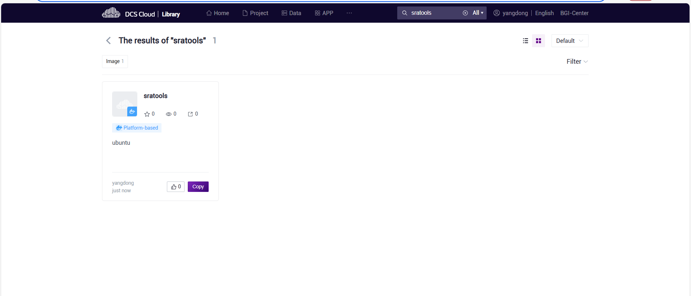

# 生信培训

# 0704

去公共库复制这个镜像，在个性分析里面使用该镜像，在资源选择选择install packages才能联网下载
> 如何使用云平台下载公共数据 *个性分析 + install package + wget or another tools*

# 0703
1. check works 
   基于seurat和scanpy绘制的umap图存在很大的差异，考虑是随机数字的问题，和在转换数据格式的时候导致一些关键信息的错位
2. formats of data change between rds and h5ad 
   - 自己部署，可以学习sceasy和schard
   - 流程解决，使用test_convert流程
3. 关于coding的问题，解决.ipynb离线查看的问题
   - 下载VScode，配置jupyter
4. 下一步的工作，文献阅读+数据恢复，得到h5ad或者rds
   - 解释一下分群和标记基因的问题
5. 后面再讲解一下singleR和sctype的方法
   - 代码学习
   - 流程使用