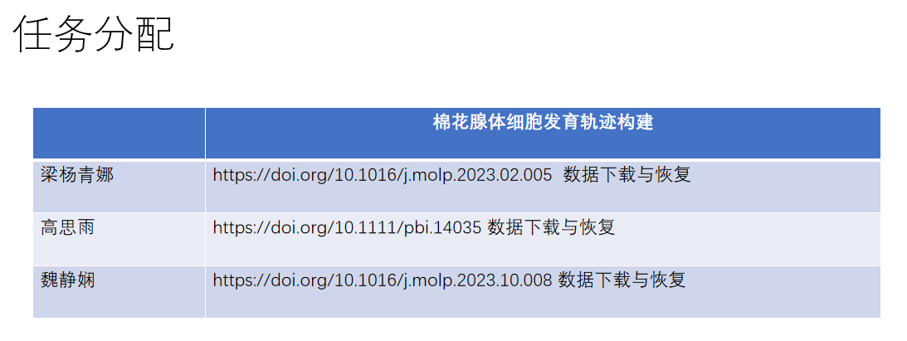

# 生信培训

# 0709
武大的同学们，15：40武汉研究院-1502检查作业和答疑
1. 作业检查
   - 水稻组：使用sctype注释水稻第10天的数据
   - 棉花组：用scPlantDB的棉花公共数据SRP241596.rds使用SAMap流程注释自测棉花数据
   - 关于这个任务完成大家的疑惑？sctype和SAMap软件的底层逻辑是什么

2. 大家的实习报告
   - 是否有相应的实习报告模板，所做的内容和收获应该形成实习报告的内容

3. 后面的工作内容
   - 水稻组 相应的工作可以询问一下黄培霖师兄，数据在035项目中

   - 棉花组 文章阅读-获取数据-(如果是fastq数据需要跑cellranger)-用Seurat或scanpy做降维分群注释-可视化umap

4. 数据类比的问题 fasta, fastq, rds/h5ad

# 0706
数据格式转换的问题，流程稳定性以及效率问题！

# 0704

去公共库复制这个镜像，在个性分析里面使用该镜像，在资源选择选择install packages才能联网下载
> 如何使用云平台下载公共数据 *个性分析 + install package + wget or another tools*

# 0703
1. check works 
   基于seurat和scanpy绘制的umap图存在很大的差异，考虑是随机数字的问题，和在转换数据格式的时候导致一些关键信息的错位
2. formats of data change between rds and h5ad 
   - 自己部署，可以学习sceasy和schard
   - 流程解决，使用test_convert流程
3. 关于coding的问题，解决.ipynb离线查看的问题
   - 下载VScode，配置jupyter
4. 下一步的工作，文献阅读+数据恢复，得到h5ad或者rds
   - 解释一下分群和标记基因的问题
5. 后面再讲解一下singleR和sctype的方法
   - 代码学习
   - 流程使用