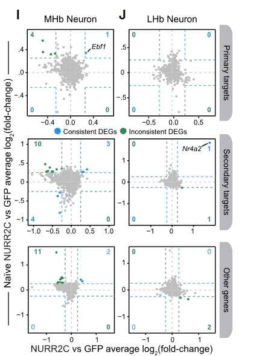
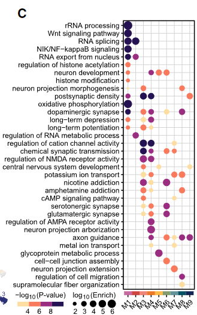

[hdWGCNA测试数据下载](https://drive.google.com/drive/folders/1yxolklYrwFB9Snwr2Dp_W2eunBxaol4A?usp=sharing)

**Co-expression network**: We define co-expression networks as undirected, weighted gene networks. The nodes of such a network correspond to gene expression profiles, and edges between genes are determined by the pairwise correlations between gene expressions. By raising the absolute value of the correlation to a power β ≥ 1 (soft thresholding), the weighted gene co-expression network construction emphasizes high correlations at the expense of low correlations. Specifically, a ij = |cor(x i , x j )|βrepresents the adjacency of an unsigned network. Optionally, the user can also specify a signed co-expression network where the adjacency is defined as a ij = |(1 + cor(x i , x j ))/ 2|β.

**Module**: Modules are clusters of highly interconnected genes. In an unsigned co-expression network, modules correspond to clusters of genes with high absolute correlations. In a signed network, modules correspond to positively correlated genes.

**Connectivity**: For each gene, the connectivity (also known as degree) is defined as the sum of connection strengths with the other network genes: k i = ∑u≠ia ui . In co-expression networks, the connectivity measures how correlated a gene is with all other network genes.

**Intramodular connectivity k IM**: Intramodular connectivity measures how connected, or co-expressed, a given gene is with respect to the genes of a particular module. The intramodular connectivity may be interpreted as a measure of module membership.

**Module eigengene E**: The module eigengene E is defined as the first principal component of a given module. It can be considered a representative of the gene expression profiles in a module.

**Eigengene significance**: When a microarray sample trait y is available (e.g. case control status or body weight), one can correlate the module eigengenes with this outcome. The correlation coefficient is referred to as eigengene significance.

**Module Membership, also known as eigengene-based connectivity k ME**: For each gene, we define a "fuzzy" measure of module membership by correlating its gene expression profile with the module eigengene of a given module. For example, MMblue(i) = 
 = cor(x i , Eblue) measures how correlated gene i is to the blue module eigengene. MMblue(i) measures the membership of the i-th gene with respect to the blue module. If MMblue(i) is close to 0, the i-th gene is not part of the blue module. On the other hand, if MMblue(i) is close to 1 or -1, it is highly connected to the blue module genes. The sign of module membership encodes whether the gene has a positive or a negative relationship with the blue module eigengene. The module membership measure can be defined for all input genes (irrespective of their original module membership). It turns out that the module membership measure is highly related to the intramodular connectivity k IM . Highly connected intramodular hub genes tend to have high module membership values to the respective module.

**Hub gene**: This loosely defined term is used as an abbreviation of "highly connected gene." By definition, genes inside co-expression modules tend to have high connectivity.

**Gene significance GS**: To incorporate external information into the co-expression network, we make use of gene significance measures. Abstractly speaking, the higher the absolute value of GS i , the more biologically significant is the i-th gene. For example, GS i could encode pathway membership (e.g. 1 if the gene is a known apoptosis gene and 0 otherwise), knockout essentiality, or the correlation with an external microarray sample trait. A gene significance measure could also be defined by minus log of a p-value. The only requirement is that gene significance of 0 indicates that the gene is not significant with regard to the biological question of interest. The gene significance can take on positive or negative values.

**Module significance**: Module significance is determined as the average absolute gene significance measure for all genes in a given module. When gene significance is defined as the correlation of gene expression profiles with an external trait y, this measure tends to be highly related to the correlation between the module eigengene and y.

hdWGCNA的模块与NMF的模块有什么不一样？

# Reference
> [2024(cell reports)_Relapse to cocaine seeking is regulated by medial habenula NR4A2NURR1 in mice](paper/2024(cell%20reports)_Relapse%20to%20cocaine%20seeking%20is%20regulated%20by%20medial%20habenula%20NR4A2NURR1%20in%20mice.pdf) [**click CODE**](https://github.com/swaruplabUCI/Relapse-to-cocaine-seeking-is-regulated-by-medial-habenula-Nr4a2)

Figure5.(I and J) Comparison of differential expression effect sizes from NURR2C vs. GFP between the experienced and naive groups. Genes that are consistently or inconsistently up- or downregulated are colored blue or green, respectively, and the number of genes in these groups are shown in the corners of each plot.

Figure6.(C) Selected GO-term enrichment results for each co-expression module.

> [2023(cell reports method)_hdWGCNA identifies co-expression networks inhigh-dimensional transcriptomics data](paper/2023(cell%20reports%20method)_hdWGCNA%20identifies%20co-expression%20networks%20inhigh-dimensional%20transcriptomics%20data.pdf) [**click CODE**](https://github.com/smorabit/hdWGCNA_paper)