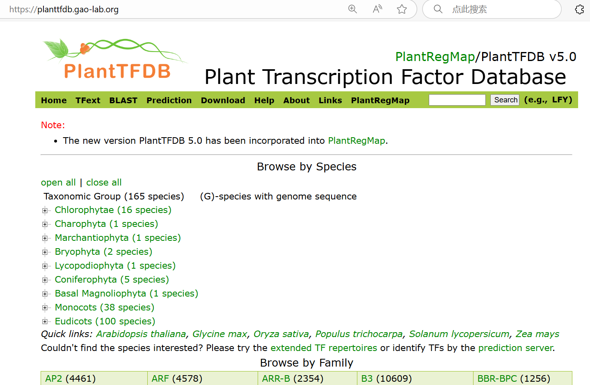

# Learn pySCENIC run GRN analysis

[不说大话！PlantTFDB没见有谁说得比我详细](https://mp.weixin.qq.com/s/nNDL95uikH-8rEXAf6hphw)
[PlantTFDB](https://planttfdb.gao-lab.org/)

[基因（转录因子）调控网络分析概念、pySCENIC报错、解决和完整流程](https://mp.weixin.qq.com/s/W23Reg6Hi4XWxpMvfctP8g)
染色质(chromatin), 基因(gene), 转录因子(transcription factor)
- 染色质与基因：染色质的状态决定了基因的可及性。基因位于染色质中，当染色质处于开放状态时，转录因子更容易结合到基因的启动子区域，启动基因的转录。
- 转录因子与基因：转录因子直接作用于基因，通过识别特定的DNA序列，启动或抑制基因的转录。这一过程受到染色质结构的影响，染色质的开放或关闭会影响转录因子的结合。
- 染色质与转录因子：染色质的结构可能会阻碍或促进转录因子对基因的访问。一些转录因子本身也能调控染色质结构（如通过招募染色质重塑复合物），从而影响基因表达。

我们要知道一个基因要发生转录，那么这个基因的转录因子就需要去结合到这个基因上游的某些位置上去，这些被转录因子识别结合并介导转录的激活/抑制的位点一般会有转录因子结合域(motif, transcription factor binding motif) ，motif的本质就是一段DNA序列，但是一段有特征的DNA序列，比如它的某些碱基会有特定的序列模式。这样的 DNA序列就叫做顺式调控元件(CRE，Cis-Regulatory Element) 。
当然我们也要知道有了转录因子/motif其实还不够，还要涉及到结合部位的状态，这个状态就收到很多因素的影响了，比如染色质活性？空间位置结构？表观遗传改变(甲基化等各种化)？等等。当然这里只是作为一个提醒，我们在做分析/实验的时候要心中有数。
因此转录所呈现出来的结果是基于上游所有信号的综合影响，理论上而言，如果需要展示更多影响转录调控的因素的话，那就是说要把调节转录的因素都要去探索一下，比如可以去做甲基化的检测，做染色质的ATAC-seq，当然更应该做一下转录因子的chip-seq等。

那么用转录组数据去预测GRN的分析分析流程的大致要求和步骤如下：
- 1、构建基因之间的共表达网络，毕竟如果两个基因之间是存在调控关系的话，那么两个基因之间必定是存在相关性的。
- 2、明确TFs，进一步需要去区分共表达网络中的分子哪些是TFs，只要知道哪些是转录因子了，就能够区分上游分子和下游分子。
- 3、明确转录因子结合位点，如果只知道转录因子和非转录因子的话那两者未必会存在结合调控，因此就必须知道在靶基因上游位置里面存在结合位点，这些结合位点里就存在一个/多个串联的motif，当得到了转录因子和motif配对关系的话，就可以是的后续构建的调控网络信息更加的准确。

[cisTarget databases](https://resources.aertslab.org/cistarget/databases/)
https://resources.aertslab.org/cistarget/
motif 到转录因子（Transcription Factor, TF） 的注释文件。这些文件列出了 DNA motif 与转录因子之间的映射关系，用于基因调控网络的研究和分析。以下是这些文件的主要信息和用途的详细说明：
1. Motif 注释文件：● Motif 是特定的 DNA 序列模式，通常是转录因子的结合位点。这些文件包含了每个 motif 与可能结合的转录因子之间的映射关系。● 这些映射关系基于特定物种的数据，因此文件分为不同物种版本，如 人类（hgnc）、小鼠（mgi）、果蝇（flybase） 和 鸡（chicken）。● 每个文件内，可能有数千个 motif，每个 motif 都会对应于一个或多个转录因子。
2. 版本信息：● v8, v9, v10 是 motif 集合的版本号，每个版本基于不同的研究和数据库更新。最新的 v10 版本基于 2022 年的 SCENIC+ motif 集合。● 不同版本之间的区别通常在于使用的数据库和算法更新，这些更新会影响 motif 到 TF 映射的精度和覆盖范围。
3. 物种特异性：● 不同的物种有各自特异性的 motif 和转录因子，因此文件根据物种进行了分类。● 人类（hgnc）、小鼠（mgi）、果蝇（flybase） 和 鸡（chicken） 的注释文件分别对应于这些物种中的 motif-TF 映射关系。

最后就会得到四个文件，分别是两个起始位点信息文件，一个motif和TFs映射关系的文件，以及一个转录因子列表文件:
  - 上下游10kb (TSS+/-10kb)
  - 上游500bp和下游100bp (500bpUp100Dw)
  - motif和TFs映射关系的文件
  - 转录因子列表文件


找到了花生的转录因子资源在PlantTFDB[Arachis hypogaea(peanut)](https://planttfdb.gao-lab.org/index.php?sp=Ahy)
这个peanut的TF数据是基于以往的，那我可不可以将新测序得到的数据（protein）提交到prediction得到TF列表
[TF prediction](https://planttfdb.gao-lab.org/prediction.php)
[TFBS prediction](https://plantregmap.gao-lab.org/binding_site_prediction.php)
prediction更像是比对，将其比对到已有的TF和TFBS关系上，进而拿到比对质量的结果，并未有发现新的TF和TFBS关系。
花生二倍体野生种Arachis duranensis和Arachis ipaensis

跑lili师姐的pySCENIC脚本需要用到的三个文件！
Seurat镜像做第一部分，pySCENIC做第二步，第三步是SCENIC的可视化
镜像pySCENIC不适合做可视化

**真正的优质的详细的教程的，非常的全面，很好的撰写逻辑，respect老师！**

[*老俊俊的生信笔记*--pySCENIC 转录因子调控网络分析教程](https://mp.weixin.qq.com/s/9n1ITFcC3fT8uyQGlL3Qtw?search_click_id=13216281811696875058-1747754421401-4602496906)
[*老俊俊的生信笔记*--pyscenic 构建自己的 cisTarget 数据库](https://mp.weixin.qq.com/s/7-vKrLiFS4Tlkt-rHxEGeQ)

# 准备.tbl文件
通过plantTFDB获取Arabidopsis thaliana的TF_motif信息
```R
download.file(
  url = "https://planttfdb.gao-lab.org/download/motif/Ath_TF_binding_motifs_information.txt",
  destfile = "Ath_TF_binding_motifs_information.txt",
  mode = "wb"
)
```
# 准备.feather文件
通过plantTFDB获取Arabidopsis thaliana的motif信息[All motifs in one file](https://planttfdb.gao-lab.org/download/motif/Ath_TF_binding_motifs.meme.gz)
根据老俊俊的笔记分别做motif的处理
后面就是以peanut建index的genome.fas和genome.gtf来找promoters
最后用pySCENIC作者提供的create_cistarget_motif_databases.py脚本拿到ranking.feather文件

# 准备TF_list.txt文件
使用blastp进行同源同源比对，去除低质量的比对数据。注意存在多对一的情况，如何解决这种问题，对到的拟南芥必须只出现一次，通过比较准确值，保留最佳的比对结果！使其最后结果是一对一。
根据这样，将拟南芥的TF txt进行重命名，只保留存在于一对一的基因
处理tbl文件，将gene_name跟一对一列表进行匹配和重命名，未匹配的全部删除
对genome的fas和gtf文件尽心处理，拿到feather文件，注意里面的基因命名系统要跟外面的一致就好

修改
```R
# 修改细胞名中以 -1 为后缀的值为 .1
cellsPerGroup <- lapply(cellsPerGroup, function(cells) {
  gsub("-1$", ".1", cells)
})
```
应该是在提取表达矩阵的时候细胞名自动将-1替换为.1，这个问题我们可以一开始检查存在的-，将其全部替换为_。这样再去替换就不会有问题了。

我刚才想到一个问题，就是用one2one对不对，理论上多个转录因子用同一个motif也很正常，还有就是可能这两个基因都是这个基因的同源基因，而为了one2one就丢弃掉这个数据，显然不合理。那么应该保留many2many的信息，尤其在TF_list和TF_blinding_motif.tbl文件里面。一个motif可能是多个target基因的前序列，也可以是多个转录因子的结合位点，一个转录因子也应该有多个motif结合位点，所以都是many2many的关系

然而我检查拟南芥的TF_motif信息竟然是一对一的关系
```shell
>>> data = pd.read_csv(input_Ath_TF_motifs_tbl, sep="\t")
>>> data.head()
  #motif_id motif_name motif_description source_name  source_version  ... similar_motif_description  orthologous_identity orthologous_gene_name orthologous_species                 description
0   MP00119    MP00119         AT1G01060   PlantTFDB             5.0  ...                      None                     1                  None                None  gene is directly annotated
1   MP00120    MP00120         AT1G01250   PlantTFDB             5.0  ...                      None                     1                  None                None  gene is directly annotated
2   MP00100    MP00100         AT1G01260   PlantTFDB             5.0  ...                      None                     1                  None                None  gene is directly annotated
3   MP00121    MP00121         AT1G01720   PlantTFDB             5.0  ...                      None                     1                  None                None  gene is directly annotated
4   MP00090    MP00090         AT1G02065   PlantTFDB             5.0  ...                      None                     1                  None                None  gene is directly annotated

[5 rows x 13 columns]
>>> len(data["motif_description"])
619
>>> len(data["motif_description"].unique())
619
>>> len(data["motif_name"])
619
>>> len(data["motif_name"].unique())
619
>>> 
```

我通过kimi和尝试认为一对一关系非常的不合理，同时检查了一下师姐tomato项目的tbl文件也是存在多对多的情况，从计算层面说明可以按多对多的方向来做
```shell
>>> data = pd.read_csv("/data/work/0.peanut/GRN/input/ITAG4.1_MOTIF_PlantTFDB.tbl", sep="\t")
>>> data.head()
  #motif_id motif_name      motif_description source_name  source_version  ... similar_motif_description  orthologous_identity orthologous_gene_name orthologous_species                 description
0   MP00295    MP00295  gene:Solyc09g010680.3   PlantTFDB             1.1  ...                      None                     1                  None                None  gene is directly annotated
1   MP00254    MP00254  gene:Solyc01g005060.3   PlantTFDB             1.1  ...                      None                     1                  None                None  gene is directly annotated
2   MP00521    MP00521  gene:Solyc01g005630.3   PlantTFDB             1.1  ...                      None                     1                  None                None  gene is directly annotated
3   MP00233    MP00233  gene:Solyc01g006650.2   PlantTFDB             1.1  ...                      None                     1                  None                None  gene is directly annotated
4   MP00367    MP00367  gene:Solyc01g009170.4   PlantTFDB             1.1  ...                      None                     1                  None                None  gene is directly annotated

[5 rows x 13 columns]
>>> len(data["motif_description"])
319
>>> len(data["motif_description"].unique())
316
>>> len(data["motif_name"])
319
>>> len(data["motif_name"].unique())
312
>>> 
```

## [Q&A 什么是Motif?](./Q&A/what_is_motif.md)
## [motif和TF是严格的一对一关系吗？存不存在几个motif对应同一TF]