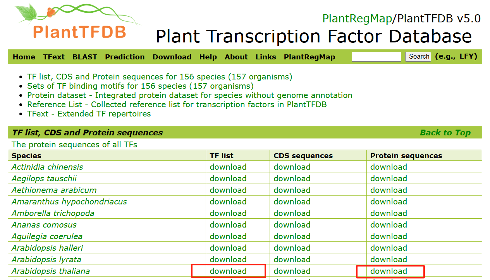
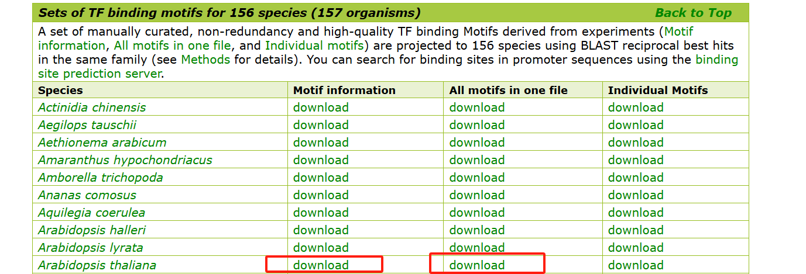

# 做peanut的pySCENIC分析的故事

写在前面：空洞的去记录一个工作和流程很容易遗忘，将具体案例/项目记下来，后面再看就会深刻许多，也好懂很多。该工作的难点如下：pySCENIC环境获得；可视化用的R版本的SCENIC环境获得；最大的难点应该就是peanut作为非模式物种缺乏输入的背景文件（tf列表`.txt`，motif信息`.feather`，tf_motif对应信息`.tbl`）。

环境搭建
pySCENIC环境：
SCENIC环境：
blastp序列比对环境：
motif处理环境：

过程：
下载拟南芥的TF列表和对应的蛋白质序列文件；
找到peanut蛋白质序列文件；
使用blastp将peanut蛋白质序列比对到拟南芥上，拿到对应关系；
找到peanut单细胞数据建index基因组的fasta和gtf；
下载拟南芥motif的meme文件，tf_motif对应信息的txt文件；
对tf_meme对应信息的txt文件进行简单处理拿到拟南芥的tbl文件；
拟南芥meme文件提取motif信息，拿到各个motif特征文件；
对peanut的genome文件处理，提取启动子序列保存未fasta文件；
利用[create_cistarget_motif_databases.py](https://github.com/aertslab/create_cisTarget_databases/blob/master/create_cistarget_motif_databases.py)将提取到的peanut启动子序列比对到motif信息上，拿到peanut存在的motif信息，即ranking.feather文件；
基于peanut和拟南芥比对信息，将拟南芥的tf_list和tbl信息进行替换，没匹配的拟南芥信息删除。

## 1.下载拟南芥的TF列表和对应的蛋白质序列文件,TF_motif对应信息和motif.meme文件


[**Download:** Arabidopsis thaliana TF list](https://planttfdb.gao-lab.org/download/TF_list/Ahy_TF_list.txt.gz)
[**Download:** Arabidopsis thaliana Protein sequences](https://planttfdb.gao-lab.org/download/seq/Ath_pep.fas.gz)



[**Download:** Arabidopsis thaliana TF_binding_motifs](https://planttfdb.gao-lab.org/download/motif/Ath_TF_binding_motifs_information.txt)
[**Download:** Arabidopsis thaliana motifs.meme](https://planttfdb.gao-lab.org/download/motif/Ath_TF_binding_motifs.meme.gz)
```R
# Suggestion download Arabidopsis thaliana TF_binding_motifs uses your PC
download.file(
  url = "https://planttfdb.gao-lab.org/download/motif/Ath_TF_binding_motifs_information.txt",
  destfile = "Ath_TF_binding_motifs_information.txt",
  mode = "wb"
)
```

## 2.处理拟南芥的TF_motif和motif.meme文件 
[get_AT.file.sh](./create_cistarget_database/get_AT.file.sh)
```shell
# Output
TF_binding_motifs_information.tbl 
./motif_dir 
motifs_id.txt
```

## 3.准备花生的基因组相关文件用于比对和建cistarget库
```shell
genome_fasta="/data/input/Files/husasa/Ref/arahy.Tifrunner.gnm2.J5K5.genome_main.fa"
genome_gtf="/data/work/0.peanut/GRN/output/updated_gtf_file_standard.gtf"
protein_fasta="/data/work/0.peanut/GRN/input/arahy.Tifrunner.gnm2.ann2.PVFB.protein.faa"
head -n 3 $genome_fasta
#>arahy.Tifrunner.gnm2.chr01
#AACCCTAAACCCTAAACCCTAAACCCTAAACCCTAAAACCTAAACCCTAAACCCTAAACCTAAACCCTAAACCCTAAACCCTAAACCCTAAACCCTAAAC
#CCTAAACCCTAAACCCTAAACCCTAAACCCTAAACCCTAAACCCTAAACCCTAAACCCTAAACCCTAAACCCTAAACCCTAAACCCTAAACCCTAAACCC
head -n 3 $genome_gtf
#arahy.Tifrunner.gnm2.chr01      Mikado_loci     transcript      19126   25719   16      +       NA      transcript_id "arahy.Tifrunner.gnm2.ann2.Ah01g000200.1"; gene_id "arahy.Tifrunner.gnm2.ann2.Ah01g000200.1";
#arahy.Tifrunner.gnm2.chr01      Mikado_loci     exon    19126   19514   NA      +       NA      transcript_id "arahy.Tifrunner.gnm2.ann2.Ah01g000200.1"; gene_id "arahy.Tifrunner.gnm2.ann2.Ah01g000200.1";
#arahy.Tifrunner.gnm2.chr01      Mikado_loci     exon    20456   20598   NA      +       NA      transcript_id "arahy.Tifrunner.gnm2.ann2.Ah01g000200.1"; gene_id "arahy.Tifrunner.gnm2.ann2.Ah01g000200.1";
head -n 3 $protein_fasta
#>arahy.Tifrunner.gnm2.ann2.Ah01g000200.1
#MSVAADSPIHSSSSDDFIAYLDDALAASSPDASSDKEVENQDELESGRIKRCKFESAEETEESTSEGIVKQNLEEYVCTHPGSFGDMCIRCGQKLDGESGVTFGYIHKGLRLHDEEISRLRNTDVKNLLIRKKLYLILDLDHTLLNSTHLAHLNSEELHLISQADSLGDVSKGSLFKLDKMHMMTKLRPFVRTFLKEASEMFEMYIYTMGDRPYALEMAKLLDPLGEYFNAKVISRDDGTQKHQKGLDIVLGQESAVVILDDTEHAWVKHKDNLILMERYHFFGSSCRQFGFNCKSLAELKSDEDEAEGALTKILKVLKQVHSKFFDELKEDIAERDVRQVLKSVRREVLSGCVVVFSRIFHGALPPLRQMAEQLGATCLMELDPSVTHVVATDAGTEKARWAVKEKKFLVHPRWIEAANYFWEKQPEENFVLKKKQ
#>arahy.Tifrunner.gnm2.ann2.Ah01g000400.1
```

## 4.获取花生基因组的启动子序列，并根据motif信息构建cistarget的database
[extra_promoters.R](./create_cistarget_database/extra_promoters.R)拿到`3kpromoter.fasta`
使用[create_cistarget_motif_databases.py](./create_cistarget_database/create_cistarget_motif_databases.py)构建cistarget_database，其中`peanut.regions_vs_motifs.rankings.feather`用做后面分析
```shell
python /data/work/0.peanut/GRN/create_cistarget_motif_databases.py \
-f /data/work/0.peanut/GRN/output/3kpromoter.fasta \
-M /data/work/0.peanut/GRN/output/motif_dir/ \
-m /data/work/0.peanut/GRN/output/motifs_id.txt \
-t 30 \
-o peanut
```

## 5.安装blastp并做两个物种的蛋白质比对找[同源基因](../Ortho_gene/)
**Reference：** [史上最详细的blast安装附视频](https://mp.weixin.qq.com/s/rEBqjN-fGOp_loTmyEuMJA)
```shell
########## Install blastp ##########
cd /software
wget https://ftp.ncbi.nlm.nih.gov/blast/executables/blast+/LATEST/ncbi-blast-2.16.0+-x64-linux.tar.gz
tar -zxvf ncbi-blast-2.16.0+-x64-linux.tar.gz
# environment location: /software/ncbi-blast-2.16.0+/bin
vim ~/.bashrc
export PATH=/software/ncbi-blast-2.16.0+/bin:$PATH
source ~/.bashrc
blastp -h
rm ncbi-blast-2.16.0+-x64-linux.tar.gz
```
```shell
########## Using blastp ##########
subject_fasta="/data/work/0.peanut/GRN/input/Ath_pep.fas"
query_fasta="/data/work/0.peanut/GRN/input/arahy.Tifrunner.gnm2.ann2.PVFB.protein.faa"
#cd /data/work/0.peanut/GRN/input/arabidopsis_db
# Make database of AT/Others
makeblastdb -in $subject_fasta -dbtype prot -out arabidopsis_db
# Query input fasta
blastp -query $query_fasta -db arabidopsis_db -out blastp_results.txt -outfmt 6 -evalue 1e-5
```

## 6.处理比对信息拿到花生和拟南芥一对一的关系文件，修改拟南芥的tbl和TF_list，拿到peanut的tbl和TF_list
[get_one2one_map2AT.file.py](./create_cistarget_database/get_one2one_map2AT.file.py)

## 7.三个准备文件可以了，就是运行[pySCENIC](../GRN-pySCENIC/)
```shell
Rscript 01.csv.R \
--input_rds /data/work/0.peanut/GRN/peanut/peanut_dataget_Anno_concat.cg_cgn.rds \
--output_csv scenic.data.csv # Image: GRN-SCENIC-R--03 /opt/conda/bin/R

python 02.csv2loom.py \
--input_csv scenic.data.csv \
--output_loom scenic.loom # Image:GRN-SCENIC-R--03 /opt/conda/bin/python

# step1 grn
pyscenic grn \
--num_workers 20 \
--output grn.tsv \
--method grnboost2 scenic.loom \
/data/work/0.peanut/GRN/peanut/TF_gene_PlantTFDB.txt # Image: pySCENIC

# step2 ctx
pyscenic ctx \
grn.tsv \
/data/work/0.peanut/GRN/peanut/peanut.regions_vs_motifs.rankings.feather \
--annotations_fname /data/work/0.peanut/GRN/peanut/Ath_TF_binding_motifs_information2.tbl \
--expression_mtx_fname scenic.loom \
--mode "dask_multiprocessing" \
--output ctx.csv \
--num_workers 20 \
--mask_dropouts # Image: pySCENIC
```

## 8.用R版本的SCENIC做可视化
[03.plot.R](03.plot.R)
