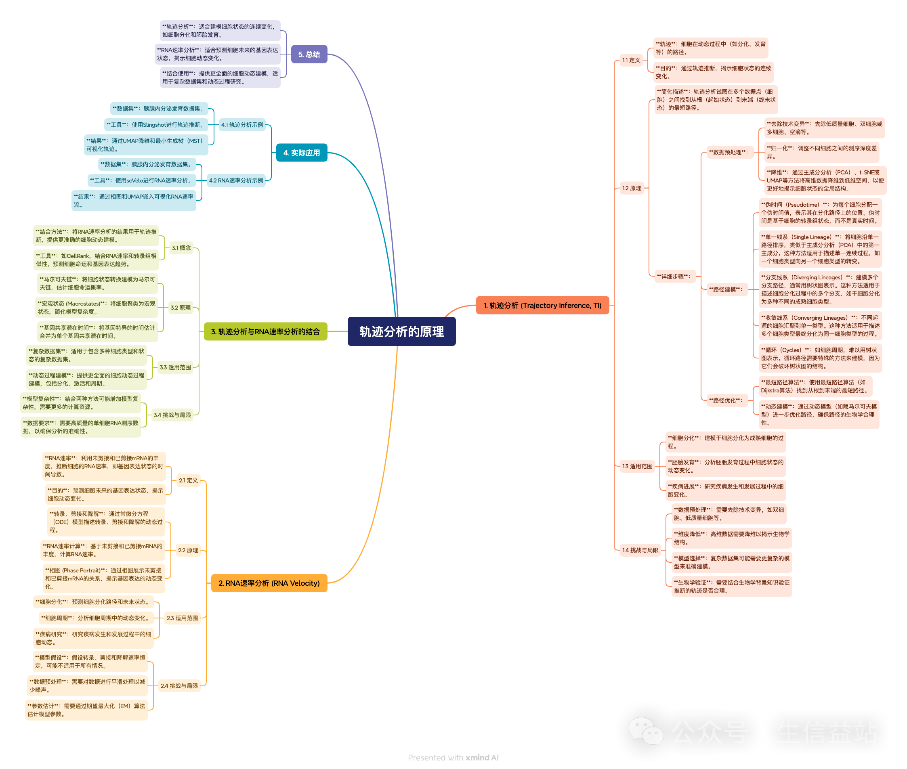
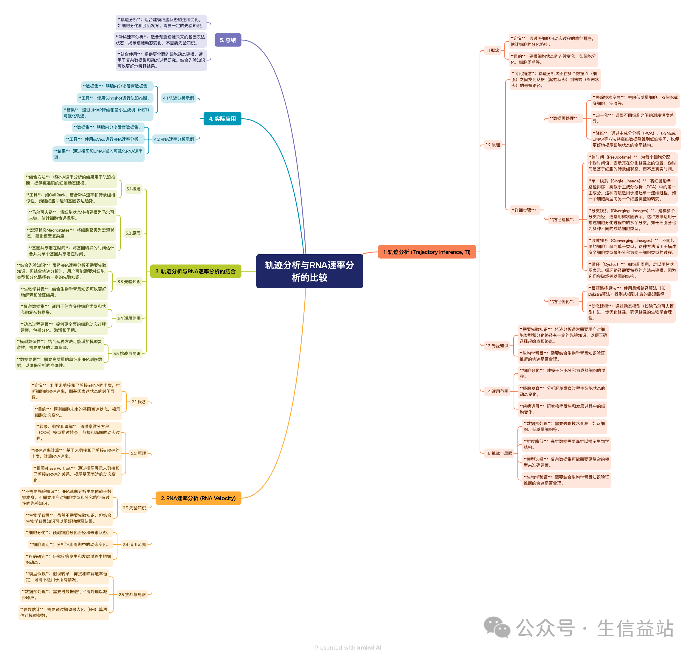

# Scripts
*First important work is sum all workflow and get a gold standard!*

## Undering building……
### [**plant_database**](): *Sum plant's database and assess high quality and using databses.*
  - Reference:
    - [*小杜的生信笔记*·植物学中常用的数据库 | 通用数据库](https://mp.weixin.qq.com/s/eWRKpZbVN8iY1qmu5mue2g)
    - [*基迪奥生物*·研究植物转录调控，你不能不知道的数据库](https://mp.weixin.qq.com/s/yee680uNUmQQUOXISr479A) [PlantTFDB](http://planttfdb.cbi.pku.edu.cn/)
    - 植物单细胞marker系列
      - [*联川生物*·植物细胞marker数据库总览，植物单细胞分析的最佳伴侣！| 植物单细胞专题](https://mp.weixin.qq.com/s/CXGkNuBDQin5MrPWMgt8ng)
      - [scPlantDB](https://biobigdata.nju.edu.cn/scplantdb/home) [*基迪奥生物*·分享一个好用的植物单细胞数据库](https://mp.weixin.qq.com/s/1dTCDc5U3dvCy15GfLRY4A)
      - [PlantCellMarker](https://www.tobaccodb.org/pcmdb/homePage) [*生信益站*·单细胞专题25| 植物细胞类型注释数据库: PlantCellMarker](https://mp.weixin.qq.com/s/Y1AyXa8jkQBV4yWo_HihTw)
      - [PsctH](http://jinlab.hzau.edu.cn/PsctH/) [*植物科学最前言*·PBJ | 华中农大开发出植物单细胞转录组综合数据库，提供综合全面的单细胞Marker基因资源和单细胞研究的workflow](https://mp.weixin.qq.com/s/5dMORWQeX4eTFgH0e1YkTg)
      - [PlantscRNAdb](http://ibi.zju.edu.cn/plantscrnadb/index.php)

### [test_data](): *Test data of model organism for check all analysis pipline*
  [The data of *Arabidopsis thaliana*(True leaf)](test_data/ERP132245.h5ad) downloaded from scPlantdb, having 2018 cells and two conditions including mild drought and normal.

### [SCPiplines](test_data/SCPiplines/): *Pack some codes as functions to high efficiently use*
  Although SCP had do this, but it could do personal works. If I want do some new works, it couldn't adapt to my need, so i decided do myself single cell piplines.
  - First question is building a image of enough do most works
```shell
# R of environment: SCr
conda create -n CHOIR r-base=4.2 -y
conda install icu=58.2
#devtools::install_github("pengminshi/mrtree")

conda create -n SCr r-base=4.3 -y
conda activate SCr
conda install conda-forge::r-biocmanager -y
conda install conda-forge::r-devtools -y
conda install conda-forge::r-remotes
conda install conda-forge::r-seurat -y
#Rscript -e 'remotes::install_github("corceslab/CHOIR", ref="main", repos = BiocManager::repositories(), upgrade = "never")'
Rscript -e 'remotes::install_github("corceslab/CHOIR", ref="dev", repos = BiocManager::repositories(), upgrade = "never")'
conda install conda-forge::r-soupx -y
conda install bioconda::bioconductor-decontx -y
conda install conda-forge::r-hgnchelper -y
conda install bioconda::bioconductor-singler -y
conda install conda-forge::r-harmony -y
conda install bioconda::r-presto -y
conda install bioconda::bioconductor-clusterprofiler -y
conda install bioconda::bioconductor-aucell -y
Rscript -e 'install.packages("GeneNMF")'
Rscript -e 'install_github("Jasonxu0109/PlantPhoneDB")'
Rscript -e 'BiocManager::install(c("WGCNA", "UCell", "GenomicRanges", "GeneOverlap"))'
# R plot
conda install conda-forge::r-openxlsx -y
conda install bioconda::bioconductor-complexheatmap -y
```

```shell
# python of environment: SCpy
conda create -n SCpy python=3.12 -y
conda install -c conda-forge scanpy python-igraph leidenalg -y
pip install memento-de
conda install bioconda::scrublet -y
```

### [Velocity and Trajectory](): *Two methods to reveal developmental process*
  Reference: [单细胞RNA速率极简教程 (3)](https://mp.weixin.qq.com/s/JAVNLCZGJlmDkzHwoD106g)



## Built
  ### [**dataget_scRNAseq**](dataget_scRNAseq): *Perform quality control of single-cell RNA-seq data using SoupX and Scrublet.*

  ### [**DEA-Seurat**](DEA-Seurat): *Conduct differential expression analysis with three Seurat functions to identify gene sets.*

  ### [**enrich_scRNAseq**](enrich_scRNAseq): *Analyze the biological functions of identified genes (e.g., GO and KEGG enrichment).*

  ### [**Ortho_gene**](Ortho_gene): *Compare datasets between two groups to identify orthologous relationships (e.g., using BLASTP).*

  ### [**GRN-pySCENIC**](GRN-pySCENIC): *Construct gene regulatory networks with pySCENIC.*

  ### [**cell_similarity**](cell_similarity): *Calculate and visualize similarity across multiple groups using Jaccard, hclust, and MetaNeighbor.*