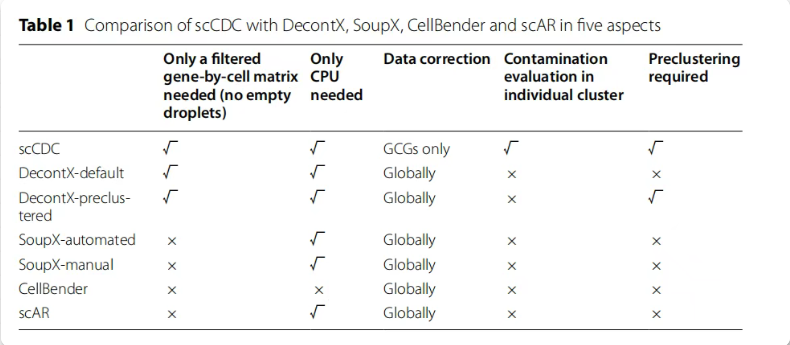
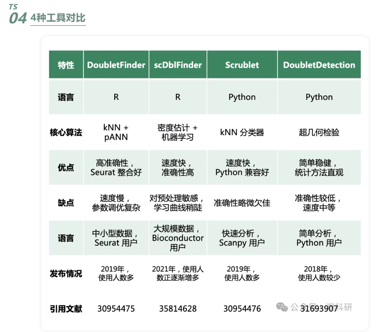

# 用[SoupX](https://github.com/constantAmateur/SoupX)和[scrublet](https://github.com/swolock/scrublet)做质控QC(dataget_scRNAseq)
<span style="font-size: 1.4em;">**Latest Version:** 1.2.0</span>
<span style="font-size: 1.4em;">**Scripts:**</span>
[Github repository of dataget_scRNAseq](https://github.com/ydgenomics/Scripts/tree/main/dataget_scRNAseq)
<span style="font-size: 1.4em;">**Result explain:**</span>
[scanpy visual result](https://mp.weixin.qq.com/s/xsxtCRFCi-y_3unfOkT-kQ)

# Quick start
  - **Overview**
    - 路线1：评估环境污染后去污，再去除双胞；
    - 路线2：只做去除双胞（考虑到去污效果差异和过处理）
  - **Parameters**

  - **Submit task**


# Many details
## 一、是什么？
### （一）什么是单细胞数据质控？
  - **单细胞数据质控**：Quality Control(QC)是单细胞测序数据分析中的一个关键步骤，目的是通过一系列质量评估和过滤操作，去除低质量的细胞和基因，从而提高下游分析的可靠性和准确性。

### （二）什么是SoupX？
  - **是什么**: SoupX 是一个R包，主要用于去除背景 RNA 污染（soup）。背景 RNA 是指在单细胞悬液中存在的游离 RNA，这些 RNA 来自裂解的细胞，可能会在测序过程中被误读为细胞内的 mRNA，从而导致数据污染。SoupX 适用于单细胞转录组测序数据的上游质控步骤，特别是在将数据合并（merge）之前进行背景 RNA 污染的去除。通过去除背景 RNA 污染，SoupX 可以显著减少技术噪声，提高下游分析的准确性和可靠性。
  - **主要功能**：
    - 去除背景 RNA 污染——SoupX 利用空液滴（empty droplets）中的游离 RNA 和聚类信息来对表达量进行矫正，从而达到去噪效果。一个液滴捕获的数据是细胞内源 mRNA UMI 总和 + 游离 mRNA 的 UMI 总和。
    - 多种校正方法
      - subtraction：通过迭代减去每个基因的预期背景计数来校正。
      - soupOnly：基于 p 值估计哪些基因可以被识别为具有内源性表达，并去除其他所有表达。
      - multinomial：通过最大化每个细胞的多项式似然来校正。
    - 提供聚类信息——为了更准确地去除背景计数，SoupX 建议提供聚类信息，这样可以在聚类级别聚合计数，从而更准确地去除背景。
    - 估计非表达细胞——SoupX 提供了 estimateNonExpressingCells 函数，用于估计哪些细胞是非表达细胞，从而用于背景 RNA 污染的估计。
  - **教程**: 
    - [github](https://github.com/constantAmateur/SoupX)
    - [demo](https://cran.r-project.org/web/packages/SoupX/vignettes/pbmcTutorial.html)
    - [SoupX tutorial](https://rawcdn.githack.com/constantAmateur/SoupX/204b602418df12e9fdb4b68775a8b486c6504fe4/inst/doc/pbmcTutorial.html)
    - Its test data of pbmc4k is downloaded in [raw](dataget_scRNAseq/data/soupx/pbmc4k_raw_gene_bc_matrices) and [filter](dataget_scRNAseq/data/soupx/pbmc4k_filtered_gene_bc_matrices)

### （三）什么是scrublet？
  - **是什么**: scrublet 是一个用于单细胞 RNA 测序（scRNA-seq）数据中检测双细胞（doublets）的 Python 工具。双细胞是指在实验过程中，两个或多个细胞被错误地封装在同一个液滴中，导致测序结果中出现混合的转录组信号。scrublet 通过模拟双细胞并使用 k-最近邻分类器来计算每个细胞的双细胞得分（doublet score），从而帮助研究人员准确地识别和过滤掉这些伪影。
  - **主要功能**：
    - 双细胞得分计算——为每个细胞计算一个介于 0 和 1 之间的双细胞得分，得分越高表示该细胞为双细胞的可能性越大。
    - 双细胞预测——基于计算得到的双细胞得分，自动设定阈值以预测哪些细胞是双细胞。
    - 数据可视化——支持在二维嵌入空间（如 UMAP 或 t-SNE）中可视化双细胞预测结果，帮助用户直观地了解数据中的双细胞分布。
    - 模拟双细胞——通过随机组合观测数据中的细胞，模拟出双细胞，用于构建分类器。
    - 无需先验知识——scrublet 不需要先验知识或预先聚类，即可识别双细胞。
    - 高效处理大规模数据——scrublet 能够快速处理大规模的单细胞 RNA 测序数据，计算出每个细胞的双细胞分数。
  - **使用scrublet的建议**
    - 单独处理每个样本——在处理来自多个样本的数据时，建议分别对每个样本运行 Scrublet，因为合并数据集中细胞类型的比例可能不代表任何单个样本。
    - 检查阈值——检查双细胞得分的阈值是否合理，并在必要时进行手动调整。
  - **教程**: 
    - [github](https://github.com/swolock/scrublet)
    - [demo](https://github.com/swolock/scrublet/blob/master/examples)

### （四）详细输出说明**
  - `Pog_root_dataget`文件夹未经过SoupX，直接scrublet去除双胞得到的结果；`Pog_root_soupx_dataget`文件夹是先经过SoupX，再scrublet去除双胞得到的结果；
    - `Pog_root_dataget/cache`文件夹是计算时缓存的原始样本文件，两个分别对应两个输入样本；
    - `Pog_root_dataget/figures`文件夹是质控后数据可视化结果
    - `Pog_root_dataget/leiden_res_0.50.markers.csv`csv文件列表是基于`resolution==0.50`聚类对genes的评分(pvalue等)，可用于下游找差异基因和富集分析；
    - `Pog_root_dataget/Pog_root_dataget.h5ad`h5ad文件用于下游整合或其它高级处理；
    - `Pog_root_dataget/qc.pdf`展示QC情况;
    - `Pog_root_dataget/summary.txt`以文本记录数据特征；
    - `Pog_root_dataget/files.txt`和`Pog_root_dataget/samples.txt`时流程运行的冗余文件，无意义；
  - `Pog_root_soupx_dataget`文件夹没有输出结果，是因为该流程内置的`Maxrho`大于SoupX测试样本的污染值；
  - `glob-c9bd58590784e8af71adedc5a333b04b/V2.5R2404290045_rho.pdf`文件夹里面输出的是两个样本在做SoupX处理时污染值评估；
  - `glob-fcbffbf81dc03967a51047ca1f92e970/soupx_rho.txt`对样本污染值的评估总结

```bash
/data/input/Files/ResultData/Workflow/W202501170013164
├── glob-c9bd58590784e8af71adedc5a333b04b
│   ├── V2.5R2404290045_rho.pdf
│   └── V2.5R2404290046_rho.pdf
├── glob-fcbffbf81dc03967a51047ca1f92e970
│   └── soupx_rho.txt
├── input.json
├── Pog_root_dataget
│   ├── cache
│   │   ├── ldfssz4-tmpfs-ST_BI-workflow-prd-cromwell-executions-volcano-dataget_scRNAseq-2f453c52-9ed0-4661-b7b6-77915c886443-call-scrublet-execution-Pog_root_dataget-V2.5R2404290045-matrix.h5ad
│   │   └── ldfssz4-tmpfs-ST_BI-workflow-prd-cromwell-executions-volcano-dataget_scRNAseq-2f453c52-9ed0-4661-b7b6-77915c886443-call-scrublet-execution-Pog_root_dataget-V2.5R2404290046-matrix.h5ad
│   ├── figures
│   │   ├── dotplot_marker.pdf
│   │   ├── pca_potentially_undesired_features.pdf
│   │   ├── umap_batch.pdf
│   │   ├── umap_leiden_clus.pdf
│   │   └── umap_quality.pdf
│   ├── files.txt
│   ├── leiden_res_0.50.markers.csv
│   ├── Pog_root_dataget.h5ad
│   ├── qc.pdf
│   ├── samples.txt
│   └── summary.txt
└── Pog_root_soupx_dataget
    ├── files.txt
    ├── samples.txt
    └── summary.txt
```

# Reference 
> **Sincerely thank all teachers and researchers who provide open source resources**
> 1. [SoupX——去除RNA污染](https://mp.weixin.qq.com/s/7g9Zo6IPqTafSjKCeAFNIQ)
> 2. [使用DecontX预测和去除单细胞转录组的环境游离RNA污染](https://mp.weixin.qq.com/s/ndt9Fsgg5dNxIOh9m7j9Bw)
> 3. [是否细胞周期矫正，去除双细胞和环境RNA污染——单细胞入门到进阶(初级篇2）](https://mp.weixin.qq.com/s/HgTVwfDfE4lzBXJKihlknA)
> 4. [单细胞去噪工具一览](https://mp.weixin.qq.com/s/78RC4qH_Kw_eb-rql_QGjg)

> 5. [还在纠结双细胞质控方法吗！一文说清楚](https://mp.weixin.qq.com/s/64hB2cj-NwojuZbdiyEGzg)


# Editor information
  - **Editor:** yangdong(yangdong@genomics.cn)
  - **Github:** [ydgenomics](https://github.com/ydgenomics)
  - **Prospect:** Do interesting and competitive works, open source and make progress!
  - **Repository:** [Scripts/dataget_scRNAseq](https://github.com/ydgenomics/Scripts/tree/main/dataget_scRNAseq)
  - **Log:**
    - 1.2.0
      - 0606 修改因`CreateSeuratObject()`自动更改基因名中'_'为'-'的问题，将task封装为函数即`run_*`；另外在流程部署上取消了脚本封装，避免多次保存环境而引起持续的问题，对于复杂流程而言，直接写R或python代码于command并不便于读
      - 20250516 统一了输出的marker基因csv包含的列`gene,cluster,p_val_adj,avg_log2FC`，便于下游分析；另外对多个resolution的marker基因的pdf和csv进行了保存`0.5, 0.8, 1.0`
      - 20250507 修改了三个矩阵存在细胞数不同的情况(Soupx处理后的矩阵)--取交集，修改了可视化pct_counts_mt的判断
      - 20250429 修改了三个矩阵整合为取基因的交集，另外为scrublet_estimate_doublecell.py运行添加了` > log.txt 2>&1`，用于保存运行过程信息
      - 20250417 优化了三个矩阵得到一个对象的基因选择，都以FilterMatrix为基准
      - 20250414 1.引入了splice和unsplice矩阵到anndata对象的layers中，有利于后面的RNA velocity分析; 2.将sample名作为后缀加到细胞名后面，保证了每个样本的细胞名不重复; 3.根据SoupX的默认参数maxrho为0.2，根据样本实际情况调整; 4.放弃了原先的大目录检索，之前的不利于流程维护，更加推荐大家使用表格投递任务
    - 1.0.0
      - 20250305 修复了无线粒体基因和有线粒体基因数据在QC质控的判断