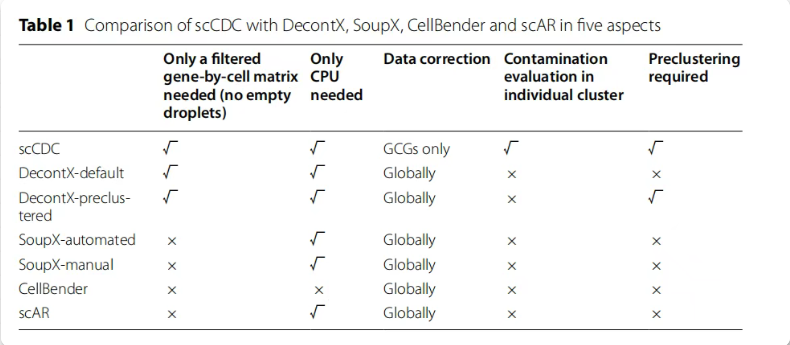
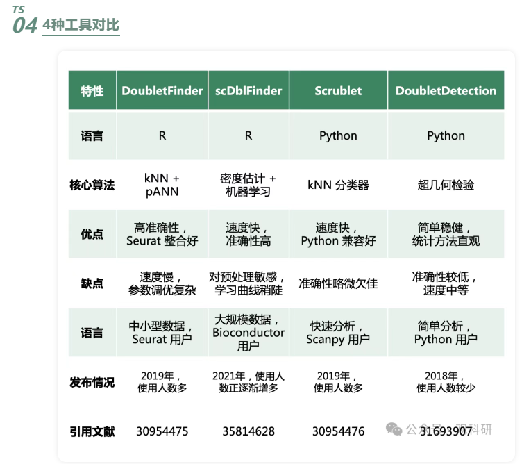

# Using [SoupX](https://github.com/constantAmateur/SoupX) and [scrublet](https://github.com/swolock/scrublet) do QC
- **Brief:** 可选的用SoupX去除单细胞实验存在的环境污染(实验室环境RNA或细胞提前破碎导致的环境RNA等)，单细胞分离时可能存在双胞捕获为一个细胞，通过scrublet评估每个细胞为双胞的得分，最后基于质控后的数据集使用scanpy做降维聚类和可视化
- **Log:**
  - 1.2.1
    - 修改为Dataget流程，支持多分组数据一次投递，新增子任务`merge`做.h5ad转.rds并merge做Seurat的标准化，该对象可用于后面做**Similarity**分析
  - 1.2.0
    - 0606 修改因`CreateSeuratObject()`自动更改基因名中'_'为'-'的问题，将task封装为函数即`run_*`；另外在流程部署上取消了脚本封装，避免多次保存环境和公布流程引起的维护问题，样本间concat也是取并集，尽量保存多的特征信息；另外在三个矩阵合并时基因取并集，至于细胞感觉也取并集，保留更多信息。
    - 20250516 统一了输出的marker基因csv包含的列`gene,cluster,p_val_adj,avg_log2FC`，便于下游分析；另外对多个resolution的marker基因的pdf和csv进行了保存`0.5, 0.8, 1.0`
    - 20250507 修改了三个矩阵存在细胞数不同的情况(Soupx处理后的矩阵)--取交集，修改了可视化pct_counts_mt的判断
    - 20250429 修改了三个矩阵整合为取基因的交集，另外为scrublet_estimate_doublecell.py运行添加了` > log.txt 2>&1`，用于保存运行过程信息
    - 20250417 优化了三个矩阵得到一个对象的基因选择，都以FilterMatrix为基准
    - 20250414 1.引入了splice和unsplice矩阵到anndata对象的layers中，有利于后面的RNA velocity分析; 2.将sample名作为后缀加到细胞名后面，保证了每个样本的细胞名不重复; 3.根据SoupX的默认参数maxrho为0.2，根据样本实际情况调整; 4.放弃了原先的大目录检索，之前的不利于流程维护，更加推荐大家使用表格投递任务
  - 1.0.0
    - 20250305 修复了无线粒体基因和有线粒体基因数据在QC质控的判断
- **Tradition:** dataget_scRNAseq
---

# Input
- **Parameters**
- 

---

# Output
[Interpretation of results](https://mp.weixin.qq.com/s/xsxtCRFCi-y_3unfOkT-kQ)

- `Pog_root_dataget`文件夹未经过SoupX，直接scrublet去除双胞得到的结果；`Pog_root_soupx_dataget`文件夹是先经过SoupX，再scrublet去除双胞得到的结果；
  - `Pog_root_dataget/cache`文件夹是计算时缓存的原始样本文件，两个分别对应两个输入样本；
  - `Pog_root_dataget/figures`文件夹是质控后数据可视化结果
  - `Pog_root_dataget/leiden_res_0.50.markers.csv`csv文件列表是基于`resolution==0.50`聚类对genes的评分(pvalue等)，可用于下游找差异基因和富集分析；
  - `Pog_root_dataget/Pog_root_dataget.h5ad`h5ad文件用于下游整合或其它高级处理；
  - `Pog_root_dataget/qc.pdf`展示QC情况;
  - `Pog_root_dataget/summary.txt`以文本记录数据特征；
  - `Pog_root_dataget/files.txt`和`Pog_root_dataget/samples.txt`时流程运行的冗余文件，无意义；
- `Pog_root_soupx_dataget`文件夹没有输出结果，是因为该流程内置的`Maxrho`大于SoupX测试样本的污染值；
- `glob-c9bd58590784e8af71adedc5a333b04b/V2.5R2404290045_rho.pdf`文件夹里面输出的是两个样本在做SoupX处理时污染值评估；
- `glob-fcbffbf81dc03967a51047ca1f92e970/soupx_rho.txt`对样本污染值的评估总结

```bash
/data/input/Files/ResultData/Workflow/W202501170013164
├── glob-c9bd58590784e8af71adedc5a333b04b
│   ├── V2.5R2404290045_rho.pdf
│   └── V2.5R2404290046_rho.pdf
├── glob-fcbffbf81dc03967a51047ca1f92e970
│   └── soupx_rho.txt
├── input.json
├── Pog_root_dataget
│   ├── cache
│   │   ├── ldfssz4-tmpfs-ST_BI-workflow-prd-cromwell-executions-volcano-dataget_scRNAseq-2f453c52-9ed0-4661-b7b6-77915c886443-call-scrublet-execution-Pog_root_dataget-V2.5R2404290045-matrix.h5ad
│   │   └── ldfssz4-tmpfs-ST_BI-workflow-prd-cromwell-executions-volcano-dataget_scRNAseq-2f453c52-9ed0-4661-b7b6-77915c886443-call-scrublet-execution-Pog_root_dataget-V2.5R2404290046-matrix.h5ad
│   ├── figures
│   │   ├── dotplot_marker.pdf
│   │   ├── pca_potentially_undesired_features.pdf
│   │   ├── umap_batch.pdf
│   │   ├── umap_leiden_clus.pdf
│   │   └── umap_quality.pdf
│   ├── files.txt
│   ├── leiden_res_0.50.markers.csv
│   ├── Pog_root_dataget.h5ad
│   ├── qc.pdf
│   ├── samples.txt
│   └── summary.txt
└── Pog_root_soupx_dataget
    ├── files.txt
    ├── samples.txt
    └── summary.txt
```
---

# Workflow
- **Overview**
  - 路线1：评估环境污染后去污，再去除双胞，质控后做降维聚类可视化；
  - 路线2：只做去除双胞（考虑到去污效果差异和过处理），质控后做降维聚类可视化；

- **Software**
  - SoupX：是一个R包，去除背景 RNA 污染——SoupX 利用空液滴（empty droplets）中的游离 RNA 和聚类信息来对表达量进行矫正，从而达到去噪效果。一个液滴捕获的数据是细胞内源 mRNA UMI 总和 + 游离 mRNA 的 UMI 总和 [demo](https://cran.r-project.org/web/packages/SoupX/vignettes/pbmcTutorial.html) [SoupX tutorial](https://rawcdn.githack.com/constantAmateur/SoupX/204b602418df12e9fdb4b68775a8b486c6504fe4/inst/doc/pbmcTutorial.html)
  - scrublet 是一个用于单细胞 RNA 测序（scRNA-seq）数据中检测双细胞（doublets）的 Python 工具。双细胞是指在实验过程中，两个或多个细胞被错误地封装在同一个液滴中，导致测序结果中出现混合的转录组信号。scrublet 通过模拟双细胞并使用 k-最近邻分类器来计算每个细胞的双细胞得分（doublet score）[demo](https://github.com/swolock/scrublet/blob/master/examples)
- **Image**
```shell
conda create -n r r-base=4.4 -y
conda activate r
conda install conda-forge::r-seurat -y
conda install conda-forge::r-soupx -y
conda install bioconda::bioconductor-decontx -y
conda install bioconda::presto -y
conda install bioconda::bioconductor-dropletutils -y
conda install conda-forge::r-optparse -y
conda install bioconda::r-sceasy -y
conda install conda-forge::r-reticulate -y
conda install conda-forge::r-devtools -y
# devtools::install_github("cellgeni/schard")
conda create -n py python=3.12 -y
conda activate py
conda install conda-forge::scanpy -y
conda install bioconda::scrublet -y
conda install conda-forge::leidenalg -y
```
---

# Reference 
> **Sincerely thank all teachers and researchers who provide open source resources**
> 1. [SoupX——去除RNA污染](https://mp.weixin.qq.com/s/7g9Zo6IPqTafSjKCeAFNIQ)
> 2. [使用DecontX预测和去除单细胞转录组的环境游离RNA污染](https://mp.weixin.qq.com/s/ndt9Fsgg5dNxIOh9m7j9Bw)
> 3. [是否细胞周期矫正，去除双细胞和环境RNA污染——单细胞入门到进阶(初级篇2）](https://mp.weixin.qq.com/s/HgTVwfDfE4lzBXJKihlknA)
> 4. [*生信钱同学*·全代码干货奉上——多样本多方案去除单细胞环境RNA污染——这次把这个聊清楚](https://mp.weixin.qq.com/s/1eJq3u-aKpQaL9CM7bV94g)
> 4. [单细胞去噪工具一览](https://mp.weixin.qq.com/s/78RC4qH_Kw_eb-rql_QGjg)

> 5. [还在纠结双细胞质控方法吗！一文说清楚](https://mp.weixin.qq.com/s/64hB2cj-NwojuZbdiyEGzg)

---

# Coder info
  - **Coder:** yangdong(yangdong@genomics.cn)
  - **Github:** [ydgenomics](https://github.com/ydgenomics)
  - **Prospect:** Do interesting and competitive works, open source and make progress!
  - **Repository:** [Scripts/dataget_scRNAseq](https://github.com/ydgenomics/Scripts/tree/main/dataget_scRNAseq)