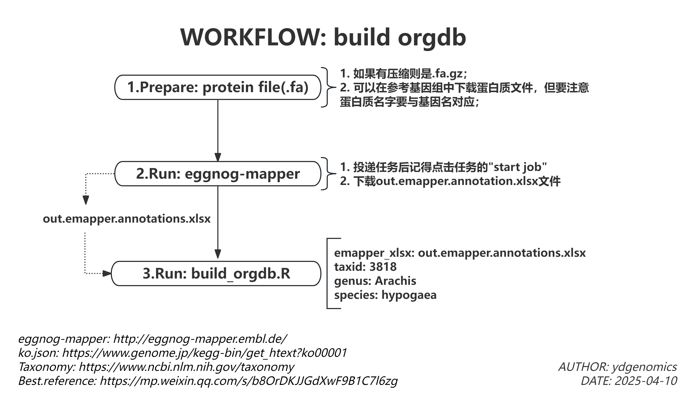

# Enrichment analysis and Visualization
**Latest version:** 1.0.4(1.0.3)
**Brief**: Bioinformatics provides statistical information such as transcript numbers, but understanding the biological significance behind these numbers is crucial. Enrichment analysis helps reveal biological meanings, such as GO terms and KEGG pathways. Since biological information is highly specialized, effective visualization is also essential.

## Quick Start

- **Parameters:**  
*If your work place isn't 035 project, you need download these files form website and submit them to cloud platform*
  - `ko_json` [download](https://www.kegg.jp/kegg-bin/download_htext?htext=ko00001&format=json&filedir=)
  - `go_obo` [download](https://gitlab.com/evogenlab/GO-Figure/-/tree/master/data?ref_type=heads)
  - `ic_tsv` [download](https://gitlab.com/evogenlab/GO-Figure/-/blob/master/data/ic.tsv?ref_type=heads)
  - `relations_full_tsv` [download](https://gitlab.com/evogenlab/GO-Figure/-/commit/48180848bace51314e5dcc4819cc6eb08ab92e45)

- **Submit Task:**  

| EntityID   | emapper_xlsx                                                                 | gene_csv                                                                 | ko_json                                                                 | go_obo                                                                 | ic_tsv                                                                 | relations_full_tsv                                                                 | genus       | species   | taxid   | minp   |
|------------|-----------------------------------------------------------------------------|--------------------------------------------------------------------------|-------------------------------------------------------------------------|-------------------------------------------------------------------------|-------------------------------------------------------------------------|-------------------------------------------------------------------------|-------------|-----------|---------|--------|
| yd_test    | /Files/yangdong/enrich/NB20250514093245n6jpxyyq/out.emapper.annotations.xlsx | /Files/yangdong/enrich/enrich_input_genelist.csv                         | /Files/yangdong/enrich/ko00001.json                                     | /Files/yangdong/enrich/go.obo                                           | /Files/yangdong/enrich/ic.tsv                                           | /Files/yangdong/enrich/relations_full.tsv                               | Arachis     | hypogaea  | 3818    | 0.05   |

## Details

- **Overview:**  
  1. build orgdb
  2. check gene names of database and input gene names
  3. enrich including Go and KEGG
  4. Visual with go-figure
  5. enrichplot(building...)

- **Environment:**  
  Image: enrich-R--04; Enrich-R--06; go-figure

- **Results:**  
  

- **Build Database:**  
  
  Ref
  > [模式植物构建orgDb数据库 | 以org.Slycompersicum.eg.db为例](https://mp.weixin.qq.com/s/b8OrDKJJGdXwF9B1C7l6zg)
  > [使用clusterProfiler对非模式植物进行注释](https://mp.weixin.qq.com/s/Mr3YLoc_-Y1WeLKJku1TzQ)
  > [富集分析|非模式物种GO/KEGG注释不会做？全网最详细eggNOG-mapper构建OrgDb包用于GO和KEGG富集分析](https://mp.weixin.qq.com/s/3sRdRuz6o5XuG11e2cX7Kw)
  > [生信干货 | AnnotationHub包-非模式物种OrgDB下载制作](https://mp.weixin.qq.com/s/auyTKJhfos0wi_yPsA7O0g)
  > [超详细非模式物种GO数据库全新代码构建](https://mp.weixin.qq.com/s/b23itzn5RNT8mJ1Ok8RzzA)

### Using eggnog-mapper to Prepare Background Database Files

[Recommended tutorial for building orgDb databases (in Chinese)](https://mp.weixin.qq.com/s/b8OrDKJJGdXwF9B1C7l6zg)

1. Obtain the protein sequences for your species. Ideally, the protein names should match the gene names in your single-cell sequencing data.  
    

2. Submit the protein sequences to [eggnog-mapper](http://eggnog-mapper.embl.de/):  
    - Select your protein sequence file.
    - Enter your email address.
    - Submit the job.
    - Click the link in your email (`Click to manage your job`).
    - Start the job and download the resulting `.xlsx` file.  
    
    
    
    
    

## References and Acknowledgements

## Coder Info

- **Editor:** yangdong (yangdong@genomics.cn)
- **GitHub:** [ydgenomics](https://github.com/ydgenomics)
- **Prospect:** Focused on innovative, competitive, open-source projects.
- **Repository:** [Scripts/enrich_scRNAseq](https://github.com/ydgenomics/Scripts/tree/main/enrich_scRNAseq)
- **Log:**
  - 20250711 Added the check query column of eggmapper, deleting repeat rows.
  - 20250616 update wdl.md(description)
  - Visualization with enrichplot will be optimized later; GSEA analysis will be added.
  - For building orgDb, input should be `go_obo` for consistency and authority, as required by Go-Figure visualization.
  - The `check` step ensures input gene sets match the background database. Since they may not match exactly, customization (e.g., adding suffixes) may be needed. The next `task: enrich` requires a CSV with columns: `gene_id`, `cluster`, `p_val_adj`. Adjust the `check` step to ensure this structure.