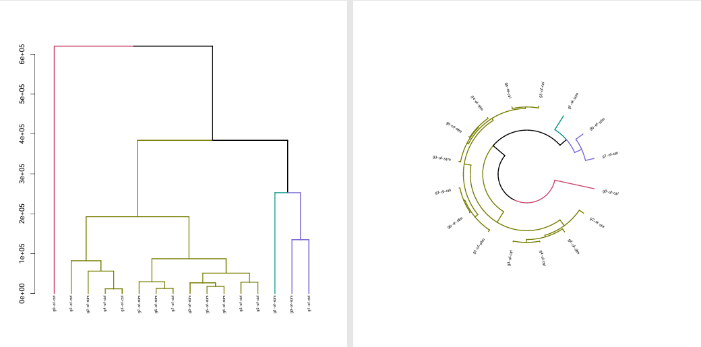

# Cluster/Cell similarity with `jaccard`, `hclust` and `metaNeighbor`

## Run it with table
**Demo table**
| EntityID | Inrds                      | names  | batch\_key | cluster\_key | cpu | mem |
| -------- | -------------------------- | ------ | ---------- | ------------ | --- | --- |
| peanut   | /Files/yangdong/peanut.rds | peanut | biosample  | celltype     | 4   | 32  |


## Explanation of Results

After running the analyses described above, you will obtain similarity matrices or clustering trees that reflect the relationships between cell types or clusters across datasets. Here’s how to interpret the results:

- **MetaNeighbor**: The output is an AUROC matrix, where each value represents the similarity between cell types across batches or datasets. Higher AUROC values indicate greater similarity and more consistent annotation between datasets.
  
  
- **Jaccard Index**: The Jaccard similarity score quantifies the overlap between marker gene sets of different clusters or cell types. A higher score means more shared marker genes, suggesting functional or biological similarity.
  
- **Hierarchical Clustering (hclust)**: The resulting dendrogram visually groups clusters or cell types based on gene expression similarity. Clusters that are closer together in the tree are more similar in their expression profiles.
  
Use these results to assess annotation consistency, validate new cell types, or compare biological similarity across datasets or conditions.

## Learn metaNeighbor [metaNeighbor.R](https://github.com/ydgenomics/Scripts/blob/main/metaneighbor/metaNeighbor.R)
[github metaneighbor](https://github.com/maggiecrow/MetaNeighbor)
[[R包] MetaNeighbor 第一期 评估不同数据集中细胞类型注释的一致性](https://mp.weixin.qq.com/s/cb9DWJm8zNc1J9wEUNTUVg)
包含应用的两个场景和结果解读

场景一：与已知注释的数据集进行相关性分析这种方法是通过比较目标数据集与已知、良好注释的数据集进行相关性分析，来验证注释的准确性。例如，在研究非模式植物时，可以采取以下步骤：基因比对：将非模式植物的基因与已知模式植物（如拟南芥）的基因进行比对。使用已知标记基因进行注释：利用模式植物中已验证的细胞类型标记基因对自己的数据进行初步注释。相关性分析：使用表达数据分析非模式植物与模式植物之间相同细胞类型的表达模式。注释到的相同细胞类型之间的表达相关性越高，表明注释的准确性越理想。
> 这种情况下得先把reference数据和test数据concat在一起之后以batch键来区别，再来跑metaNeighbor,所以跑这个应该在integration之后

场景二：使用特定标记基因进行人工注释当缺乏已知的参考数据集时，可以使用特定于研究对象的标记基因进行人工注释：标记基因选择：选择非模式植物特有的、已知功能的标记基因。人工注释：使用这些标记基因对数据进行人工注释，确定细胞类型。跨数据集验证：比如我研究一种新的植物-菜花！现有两个菜花数据集，我在这两个数据集中都能注释出相同的细胞亚型（例如，细胞类型A、B、C）。在各个数据集中注释出的相同标签的细胞类型应表现出高度的表达相似性，这有助于证明注释的稳健性和一致性。
这里计算的是矩阵，应该也涉及到reference数据基因名和test数据基因名覆盖度的问题

```R
#使用MetaNeighbor计算每个批次中细胞类型之间的相关性
Aurocs_matrix = MetaNeighborUS(var_genes = global_hvgs, 
                               dat = cca.results.sce, 
                               study_id = cca.results.sce$batch, 
                               cell_type = cca.results.sce$celltype, 
                               fast_version = T)
```
计算的是矩阵的那一层呢？counts还是data。计算的是SCT，先判断是否具有SCT，然后在做计算，如果还存在批次的话可以使用harmony做一个整合去批次

## Jaccard指数和hclust [jaccard_hclust.R](https://github.com/ydgenomics/Scripts/blob/main/metaneighbor/jaccard_hclust.R)
[常被提起的Jaccard指数是什么？怎么在单细胞中运用和实现Jaccard相似性比较？](https://mp.weixin.qq.com/s/-6iM2phNUh2Qo0wbN0Azpw)
jaccard指数常被文章用来衡量细胞间的相似度
运用jaccrd指数衡量相似性实际上被广泛运用于:
  - seurat聚类流程
  - 比较新发现的细胞亚群和既往亚群的相似性
  - 比较不同测序方法的吻合度
  - 比较不同物种的细胞类型相似性

Jaccard相似度是衡量两个集合相似度的⼀种⽅法。Jaccard相似度 = (交集⼤⼩)/(并集⼤⼩),其值介于0和1之间，数值越⼤表示两个集合的相似度越⾼。在细胞相似度评估中，若Jaccard相似度表现出较⾼的重叠，这有可能表明它们可能代表具有相似功能。具体实现时，可以通过FindAllMarker()获取所要评估的两种细胞的各自特征基因，并基于特征基因计算jaccard相似度

hclust即层次聚类，获取各个cluster的基因表达(SCT的counts矩阵)，生成树结构以表示距离/相似性
[练习R：hclust()函数层次聚类分析](https://mp.weixin.qq.com/s/-AvRPX7DG5fzyAVmv8wg7Q)
