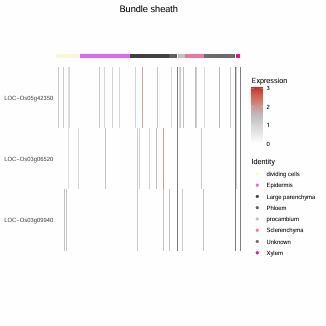
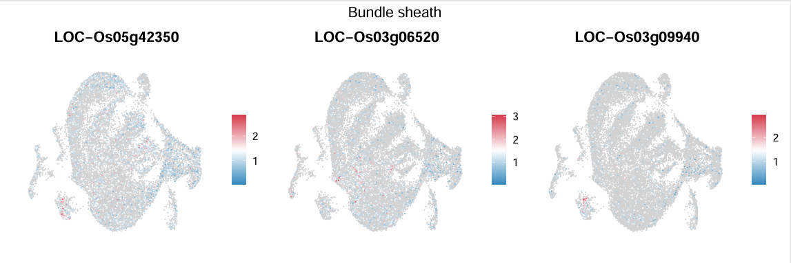
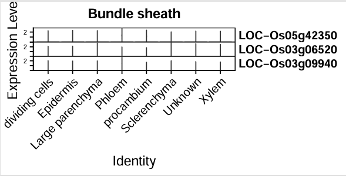
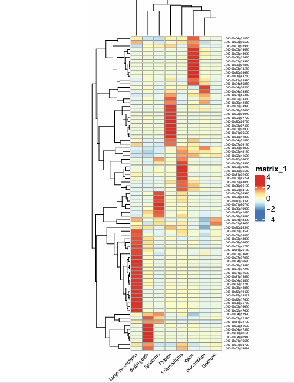
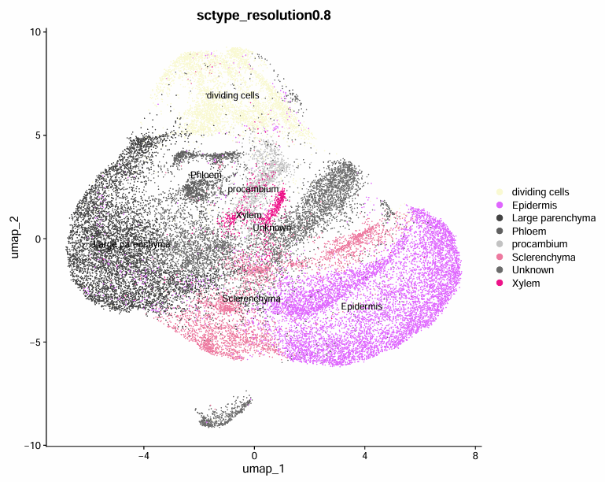
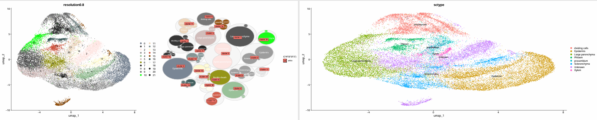

# [What is cell/cluster Annotation in scRNA-data?](https://pluto.bio/resources/Learning%20Series/annotating-clusters-in-scrnaseq)
**Brief**: Single cell RNA sequencing (scRNA-seq) has revolutionized the way we study gene expression at the individual cell level. However, once you’ve performed clustering to group similar cells together, you’re faced with one of the most challenging tasks in scRNA-seq analysis: annotating your clusters. Cluster annotation is the process of assigning biological meaning to these groups, essentially identifying the cell types or states that each cluster represents.[List of annotation tools and approaches](https://airtable.com/appMd0h4vP7gzQaeK/shrgmvY3ZvswENjkJ/tblgv3JRYlbD34DYD)

**Methods**
  - 第一种策略：利用现有的基因集和参考数据库
  - 第二种策略：借助人工智能（AI）工具 scGPT scPlantLLM
  - 第三种策略：应用机器学习方法
  - 第四种策略：使用算法方法或专用软件
  - 第五种策略：结合领域知识进行手动注释

**Database of Markers**
  - [*联川生物*·植物细胞marker数据库总览，植物单细胞分析的最佳伴侣！| 植物单细胞专题](https://mp.weixin.qq.com/s/CXGkNuBDQin5MrPWMgt8ng)
  - [scPlantDB](https://biobigdata.nju.edu.cn/scplantdb/home) [*基迪奥生物*·分享一个好用的植物单细胞数据库](https://mp.weixin.qq.com/s/1dTCDc5U3dvCy15GfLRY4A)
  - [PlantCellMarker](https://www.tobaccodb.org/pcmdb/homePage) [*生信益站*·单细胞专题25| 植物细胞类型注释数据库: PlantCellMarker](https://mp.weixin.qq.com/s/Y1AyXa8jkQBV4yWo_HihTw)
  - [PsctH](http://jinlab.hzau.edu.cn/PsctH/) [*植物科学最前言*·PBJ | 华中农大开发出植物单细胞转录组综合数据库，提供综合全面的单细胞Marker基因资源和单细胞研究的workflow](https://mp.weixin.qq.com/s/5dMORWQeX4eTFgH0e1YkTg)
  - [PlantscRNAdb](http://ibi.zju.edu.cn/plantscrnadb/index.php)

---

# Using [sctype](https://github.com/IanevskiAleksandr/sc-type) do annotation of cells/clusters
**Overview**
sctype：csv格式的marker基因列表。关注查询数据集的scale.data的矩阵，按查询分群来做注释，一个群可能会被分到多个细胞类型，取最优，同时如果太差会被认定为Unknown。csv的marker基因要尽可能多的存在于查询数据的scale.data的基因中
  1. 提取seurat对象scale.data矩阵数据，所以marker是hvg很重要！；
  2. 根据细胞类型对应的marker基因得到**细胞类型×细胞名**的表格，值为基因表达值(scale.data)计算得到的`sctype_score`，所以marker基因一定要为hvg，或者就没法在scale.data找到。实现了将几千的维度降低到二位数以内，而且维度与细胞类型直接关联
  3. 关注每个细胞在各个细胞类型的得分，基于得分高低可以把每个细胞注释为得分最高的细胞，对于我们关注的cluster而言，一个cluster的每个细胞都是单独注释的，这样就可以得到这个cluster里面有多少个细胞注释为该细胞类型，对应的得分应该是累计的，最后将该cluster注释到的细胞类型得分进行排序，只展示前10得分
  4. 取每个cluster得分最高的细胞类型就可以将该cluster注释为该细胞类型
  5. 对于低代表性的群注释为"Unknown"，该cluster的细胞类型得分差距都不大
  6. 源代码：可视化大小圈意义，大圈是cluster细胞数，小圈是score大小，但是存在score大于细胞数的情况，导致大圈被迫变大而非真实的细胞数
  7. 修改后的可视化解决了三个问题，umap分群颜色和圆圈图颜色对应、大圈大小与细胞数正相关、小圈大小为得分占比乘以细胞数大小(保证小圈永远小于大圈大小)

**Input**

|变量名|类型|必需|推荐值|参数说明|
|-|-|-|-|-|
|input_query_rds|File|是|`/Files/yangdong/wdl/multi_anno/NipLSD10_anno_merged_data_obj_after_choir.rds`|待注释的Seurat对象(`.rds`)|
|marker_csv|File|是|`/Files/yangdong/wdl/multi_anno/rice_leaf_marker0614.csv`|指定细胞表达的marker基因(`.csv`)|
|tissue|String|是|`"leaf"`|组织类型|
|cluster_key|String|是|`"CHOIR_clusters_0.05"`|待注释的Seurat对象列名|
|reduction_key|String|是|`"CHOIR_P0_reduction_UMAP"`|降维方式(如`"umap"`)|
|save_rds|String|是|`"checked.rds"`|保存文件名(需以`.rds`结尾)|
|n_circle|Int|是|`5`|每个cluster/circle包含最多数量|
|mem|Int|是|`8`|资源|
|cluster_color_csv|File|是|`-`|`cluster_key`唯一值与颜色的对应关系|

  - input_query_rds: 包含RNA(counts, data, scale.data); 分群的键名，降维储存的键(reduction)
  - marker_csv: Four columns(`tissueType`,`cellName`,`geneSymbolmore1`,`geneSymbolmore2`,`shortName`), `geneSymbolmore1` stores high expression genes and `geneSymbolmore2` stores low expression genes. Template marker.csv [download]()
  - cluster_color_csv: Two columns(`cluster`,`color`). Template cluster_color.csv [download]()

**Script**
rds_check: Check data structure of Seurat object, must include three matrixes and reduction, if you want to do NormalizeData or Scaledata, this section is easy for you.
marker_plot: Sctype annotation positively depend on the high quality marker genes, this selection is plotting these genes and conviently check its quality. [visual_cg.R](./plot/visual_cg.R)
sctype: Do annotation and its annotaion result stores in `sctype` column. [run_sctype.R](./script/run_sctype.R)

**Output**

1. marker_plot result 
  
  
  
  
  

2. sctype result 
```shell
### _nodes.csv: draw circrle plot
head -n 3 NipLSD3_anno_merged_data_obj_after_choir_sctype_nodes.csv
# "cluster","ncells","Colour","ord","shortName","realname"
# "Epidermis_0",3551.34632226944,"gray82",2,"Epidermis","Epidermis"
# "Epidermis_8",404.634348967905,"gray65",2,"Epidermis","Epidermis"

### _sctype_scores_sorted.csv: each cluster is annotated to cell type
head -n 3 NipLSD3_anno_merged_data_obj_after_choir_sctype_sctype_scores_sorted.csv
# "cluster","type","scores","ncells"
# "21","Epidermis",260.197952331253,270
# "3","Epidermis",1614.05538104017,2264

### report.txt: marker survey in scale.data
head report.txt
###These marker genes are not found in the input scale.data of scRNA-seq data:
#  [1] "LOC-Os10g26340" "LOC-Os01g67410" "LOC-Os05g45460" "LOC-Os06g44750"
#  [5] "LOC-Os04g04330" "LOC-Os04g52920" "LOC-Os02g07770" "LOC-Os07g07950"
#  [9] "LOC-Os01g20160" "LOC-Os07g04180" "LOC-Os04g51830" "LOC-Os08g08820"
# [13] "LOC-Os07g37030" "LOC-Os01g55350" "LOC-Os08g44810" "LOC-Os07g34640"
# [17] "LOC-Os04g16680" "LOC-Os03g16050" "LOC-Os02g47020" "LOC-Os02g05830"
# [21] "LOC-Os11g26160" "LOC-Os08g06630" "LOC-Os04g48390" "LOC-Os03g48000"
# [25] "LOC-Os02g45520" "LOC-Os01g69030" "LOC-Os03g43290" "LOC-Os05g42350"
# [29] "LOC-Os03g09940"

### _sctype.rds: saved annotated Seurat Object
# NipLSD3_anno_merged_data_obj_after_choir_sctype_sctype.rds

### _sctype_umap.pdf: visualize annotation result
# NipLSD3_anno_merged_data_obj_after_choir_sctype_sctype_umap.pdf
```



**Reference**
> [单细胞全自动注释篇(四)——ScType](https://mp.weixin.qq.com/s/hKBiZCHwDdoJOk0YChbtMA)

**Coder**
  - [yangdong/yangdong@genomics.cn](https://github.com/ydgenomics)
  - [anno_sctype](https://github.com/ydgenomics/Scripts/tree/main/multi_annotation_scRNAseq)
  - log:
    - 250718 First finish!

---

# Using [singleR](https://github.com/dviraran/SingleR) do annotation of cells/clusters
**Overview**
singleR: 拿到参考数据集的RNA@counts矩阵后，计算每种细胞的平均表达量后做log处理。而查询数据集的data矩阵按每个细胞去拟合参考数据集的细胞类型表达模式，所有两个数据集共同所有的基因数很重要。参考数据集获取可以来自于scRNA，也可以bulkRNA，因为最终是对数据集bulk化，参考数据集最终是**细胞类型×基因**的矩阵。
我有一个疑问,构建reference对counts做的logcounts处理和查询数据做了Normalization的data，在计算方式上不一样，这样会影响singleR注释。假设不考虑两次数据实验误差。我想到了，如果singleR设计的时候查看的是不同基因的波动而非专注于某个值的话，就不会在意这个问题
logcounts()：对原始计数数据进行对数转换，减少数据的偏态分布。输出对数转换后的矩阵，值的范围通常在0到10之间。
Normalization()：对原始计数数据进行归一化处理，调整每个细胞的总读数。输出归一化后的矩阵，值的范围通常在0到1之间。

**Input**

**Script**

**Output**

**Reference**
> [使用singleR基于自建数据库来自动化注释单细胞转录组亚群](https://mp.weixin.qq.com/s/GpOxe4WLIrBOjbdH5gfyOQ)

---
