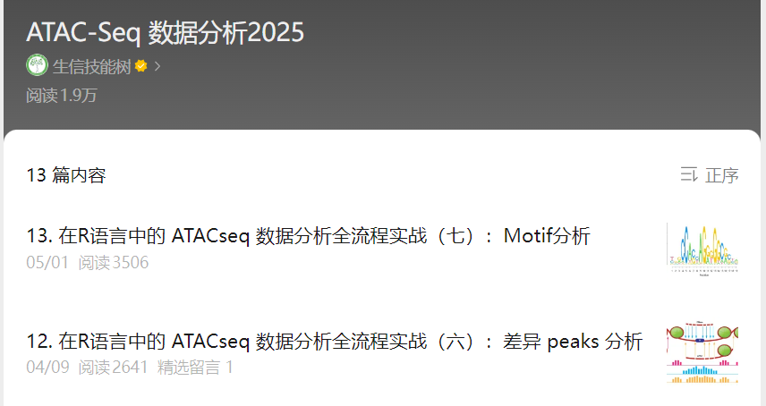

# 学习ATAC(buk + sc)

---

ATAC-Seq可以用来：
  1. 生成表观基因组学特征
  2. 在不同组织或条件下绘制可及染色质图谱
  3. 检索核小体位置
  4. 识别重要的转录因子
  5. 生成转录因子的占用特征（足迹分析）

[*生信技能树*·ATAC-Seq](https://mp.weixin.qq.com/mp/appmsgalbum?action=getalbum&__biz=MzAxMDkxODM1Ng==&scene=1&album_id=3825619502127398912&count=3#wechat_redirect)

---

[1.综述：ATAC-Seq 数据分析工具大全](https://mp.weixin.qq.com/s/DSm7z9Z2QYfZJ5A_Ch7Z6g)

[ATAC中文学习资源](https://mp.weixin.qq.com/mp/appmsgalbum?__biz=MzAxMDkxODM1Ng==&action=getalbum&album_id=3825619502127398912&subscene=189&scenenote=https%3A%2F%2Fmp.weixin.qq.com%2Fs%3F__biz%3DMzAxMDkxODM1Ng%3D%3D%26mid%3D2247538904%26idx%3D1%26sn%3Db8a8393137c5e599e5f7a1b33715d4e9%26chksm%3D9b4b1863ac3c91750db3d0d5f0732905197bffcf786454309094cebc96e797c07f6a04dd1fb0%26cur_album_id%3D3825619502127398912%26scene%3D189%26key%3Ddaf9bdc5abc4e8d0851611211b85885dbdc306f6d992b3cef8eef0c0bcbdab0f778f294c8cf6dc082f581bcc7372b6ba2704cfeba7cc937b4c98742ff897e7d4ef4aa9ebe4ec334af028e6b504b6ebaf6884621c2102adb09d725771c46bffe01085ee6b39742271db5cf8ed655d013022afe79bf821c1cab206482948f7071b%26ascene%3D0%26uin%3DNDIxMzk4MTk3%26devicetype%3DWindows%2B11%2Bx64%26version%3D63090c33%26lang%3Dzh_CN%26countrycode%3DCN%26exportkey%3Dn_ChQIAhIQj6Pe6cyNMp0D49NAt6LmZhLmAQIE97dBBAEAAAAAADdcNmS%252Ba1sAAAAOpnltbLcz9gKNyK89dVj0i0JJwIhsKgwUiurYkjY88FVyEcYdGphnQEO%252BTD7vXb3GyCJ08cCSqMxRu84V%252BKSftWd8WdCpmr2pJkv%252BhE2vorTlAHRfqzfloGOnFLfdITdFvP1MHIjPdUzj%252BVCQuDfaSkJ0KH4hjvpgjupLYHVsnw1uIufC9PqVNG2pMTYP4hofIoopMBQ9F9hhjKYkscLj9hBb2Ax8mwR1jr1PmdfM37AmfZb01SkUYHoKOpeyRqTToCjQBequnmoNVvx9fTxj%26acctmode%3D0%26pass_ticket%3D%252BzkNfT%252FzC8z%252F2ygWf1AwYZ%252FAlE81E1r%252BDRKfc8SQYA1gtHVgExFF1b108S4Q5jGj%26wx_header%3D1&nolastread=1&sessionid=1742267548#wechat_redirect)